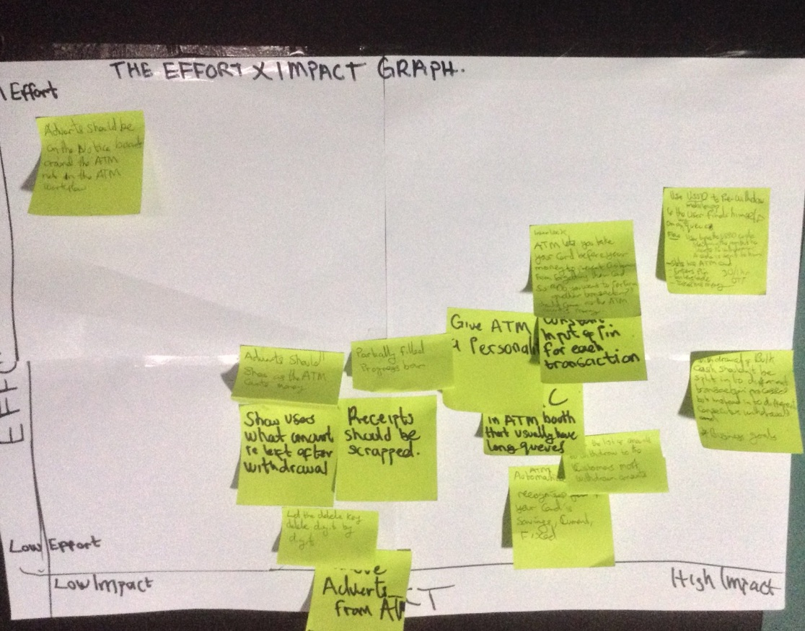
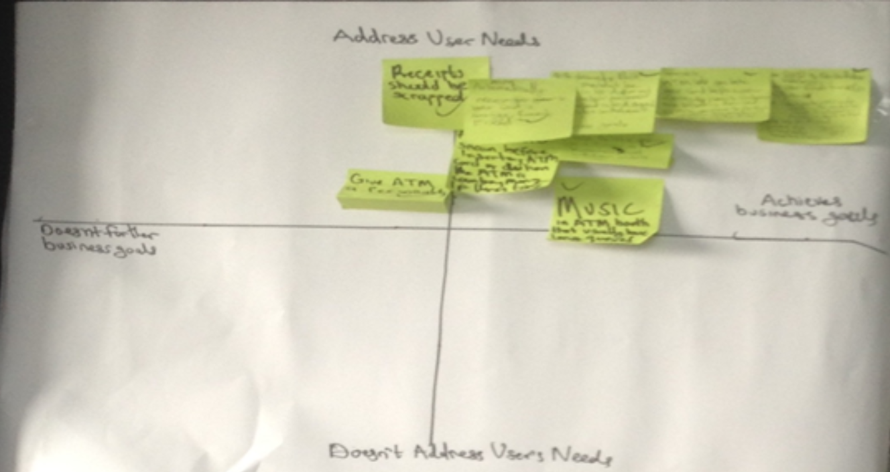
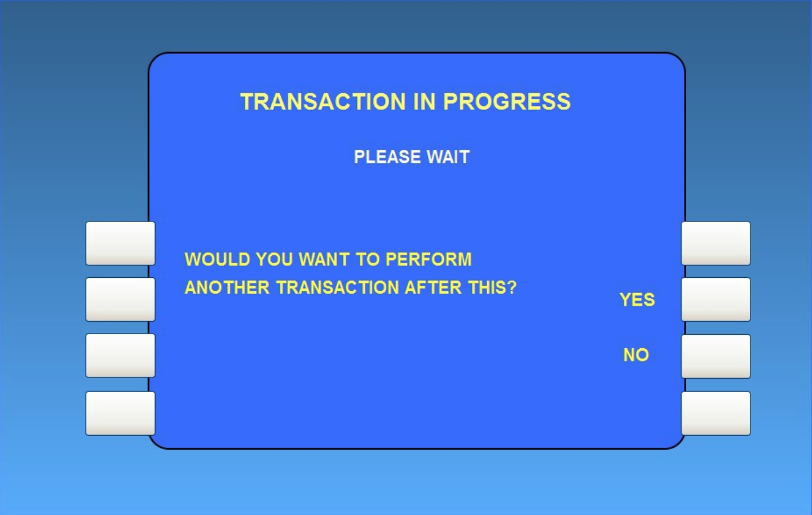
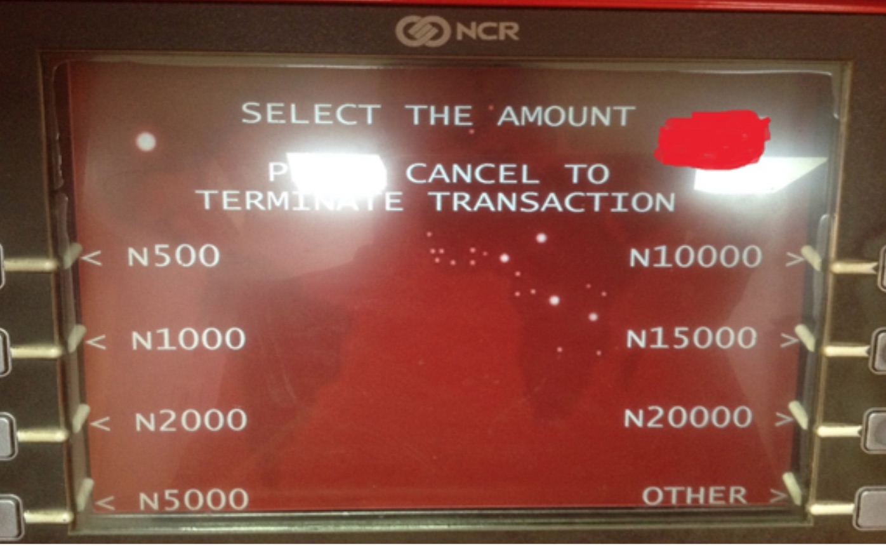
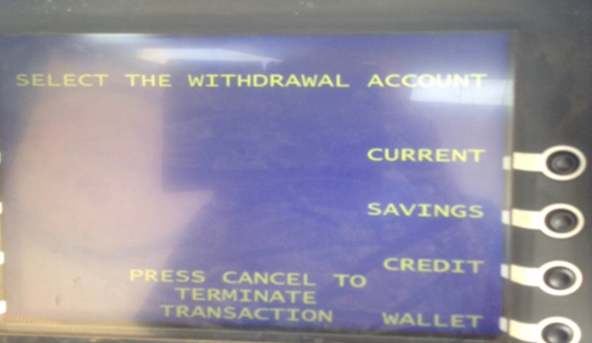

# 案例研究：重新设计ATM体验

在使用 ATM（自动柜员机）多次受挫后，我决定从抱怨者转变为问题解决者。我作为我的第一个UX项目，重新设计了ATM体验。

项目目标：

* 减少从ATM取款所需的步骤数，从而减少在ATM上花费的总时间。

* 改善使用ATM的整体体验。

## 收集用户研究
我使用的主要用户研究方法是：
1. 上下文查询 - 在这里我观察了用户使用ATM的情况。

2. 用户访谈 - 我采访了用户，了解他们使用自动柜员机的目标和难点。

3. 专家和利益相关者访谈 - 作为设计解决方案时的UX设计师，您需要平衡业务目标和用户目标。所以我采访了一些银行职员，了解银行的目标。

虽然我是一名普通的ATM用户，但我自己使用自动取款机获得了新的见解。

除了用户研究之外，我还通过以下方式评估了ATM体验。

#### 用户流量

我开发了用户流程图，以识别用户从ATM取款时受到的挫折和不必要的步骤。

#### 扩展用户旅程地图（记住差距）
作为一名用户体验设计师，我相信能够满足用户的需求，而这可能是人们认为的一分钟。当用户使用产品时，他们希望从当前的情况中获取更好的情况。从没有手头现金到现金做为他们的日常活动。我问自己两者之间发生了什么，用户旅程向我们展示了这一点，但随后在用户旅程的每一步之间发生了什么。我问自己“两者之间发生了什么？”然后“我该如何帮助他们。”要设计出色的解决方案，您需要“注意差距”并注意细节，因为设计在细节中。不要让用户处理它。应用此功能后，我能够发现更多用户痛点。

#### 启发式分析
我根据10个公认的可用性原则或启发式方法评估了当前的ATM界面。他们是：
1. 系统状态的可见性

2. 系统与现实世界的匹配

3. 用户控制和自由

4. 一致性和标准

5. 防止错误

6. 对取消的认可

7. 灵活性和使用效率

8. 美学和简约的设计。

9. 帮助用户识别，诊断并从错误中恢复。

10. 帮助和文档

#### 亲和力映射 - 理解研究数据
为了总结和理解我从研究中获得的数据，用户流程图和启发式分析，我决定创建一个亲和力图。我从研究数据中挑选出相关信息，并在便签上写下来。我将带有相关信息的便签安排到群集中。我重新评估了每个粘性集群中的信息并将其写在粘性集群上。

这些是收集的主要痛点：

1. 排长队。

2. 取款后在ATM上忘记ATM卡。

3. 不必要的收据。

4. 被要求选择提款账户，即储蓄账户，当前账户或固定账户。

5. 每次交易的密码输入。

6. 缓慢的流程和网络问题。

7. 无法立即提取大量现金。

8. ATM允许您完成撤销的整个过程，只是告诉您最后没有钱或其他一些令人心碎的新闻。

#### 思维

我重新解释了每个问题，并使用了流行的'How Might We'技术。我一次拿起一个痛点，试图尽可能多地提出解决方案。接下来，根据我对行为设计的了解，我决定采用说服性设计模式的帮助 - 它们包括基于心理学驱动的洞察力的不同设计原则。因此，我探讨了如何使用这些有说服力的模式来改善体验。

#### 评估想法

即使我独自一人，我想出了很多想法，但并非所有的想法都要实施。所以我使用这两组标准过滤并优先考虑我的想法。

#### 影响与努力图

我评估了我的想法，并根据它们的潜在影响和实施它们所需的努力将它们绘制在图表上。选择了进入低成本高影响和少数周围想法的圣杯的想法。

#### 业务与用户目标矩阵

作为用户体验设计师，您不断寻求平衡用户目标和业务目标。因此，您更多地关注那些属于对业务有利并且对用户有益的最佳点的想法。

因此，我在矩阵上绘制了剩余的想法，并选择了最佳点作为解决方案，同时保持其他想法的积压。

## 解决方案

最终的解决方案是：

#### 1.使用USSD“预撤回”

当客户发现自己长队时，他们可以使用手机预先选择他们想要提取的金额。因此，一旦他们到达ATM，他们只需插入他们的卡并收取他们的钱。

以下是一个示例场景：

Emeka需要为他母亲的药品取款 5000 naira。他去ATM，发现排长队。他加入队列然后拿出他的电话类型USSD代码预先取款（例如* 432 * ATM Pin *金额退出＃）。银行给他的电话发送了一次性密码（OTP），有效时间约30分钟。

当轮到他使用自动取款机时，他插入他的卡，输入他的密码并继续输入OTP，钱出来，他拿走他的钱。

因为与Emeka一起排队的大多数人都知道这种方法，所以很多人都这样做，从而减少了大约一半排队时间。

#### 2.ATM禁止用户在插入ATM卡之前领到钱
ATM只允许用户在他们拿走ATM卡后再得到他们的钱，以防止用户在取款后在ATM上忘记他们的卡。“交易正在进行中”出现提示“您是否要执行另一笔交易”。用户很难忘记他们的钱。

#### 3.提取大量现金
当提取的现金额高于ATM限制时，ATM允许用户选择大量现金，但这笔钱不是立刻出来的，而是分批的，无论ATM的限制是多少。有人可能会说为什么不让ATM立刻拿出钱，但在与一些银行家交谈之后，我发现这个解决方案可以更好地平衡用户目标和银行目标。

#### 4.取款金额界面
当从ATM取款时，您将到达一个页面，其中显示可供选择的金额列表以及选择其他金额的选项。根据我对许多ATM用户的观察，尽管多次使用ATM，他们仍然没有在该页面上学习金额的安排。每次他们到达该页面时，他们会扫描整个列表以找到他们想要提取的金额，如果不存在，则单击“其他”按钮。一家银行试图通过在那里只放一个金额来优化这个页面，我不知道是什么导致他们选择了特定的金额，但是从我采访过的用户看来他们似乎不喜欢这个开发。

因此，我的解决方案是银行将此页面上显示的金额定制为用户的前四个经常提取的金额。我选择了四个而不是正常八个，因为用户的思维很容易在没有太多认知负荷的情况下解释它，并且我把它们放在靠近中心的位置，因此它将在用户的中心视野内，而不是像普通ATM安排那样的周边视觉。最后，我为用户提供了第五个选项，以便在同一页面上输入他想要的金额。

#### 5. ATM自动识别您在ATM卡中插入的帐户类型，而不是要求您指定是储蓄，当前还是信用帐户。

#### 6.收据应该报废!!!
根据我的研究，许多人不接收ATM上的收据，即使他们选择，ATM也会告诉他们打印机错误，即使它出来也会把它扔掉。总结是ATM收据几乎没有到达家中。收据作为付款证明，因此发送给用户的电子邮件和短信应该这样做。

#### 7.人性化
银行的ATM银亭有很多人，应该播放平静的音乐（ASA类型的音乐）或乐器来缓解紧张情绪，让排队体验更加愉快。研究表明，音乐会影响人类的情绪状态，减轻压力和焦虑。

## 其他一些没有进入最终名单的想法是

1.赋予ATM个性。

2.添加进度条。

3.将ATM UI从主要文本升级到高度图形化的UI ......

## 结论

与其他服务或产品不同，如果用户感到沮丧，他可以轻松离开并去竞争对手那里，对于ATM用户，他不只是离开银行去另一家银行。改变银行需要更多的努力。但是，当使用自动柜员机的麻烦与其他银行服务的重复不良经验相结合时，它就会决定改变他的银行。因此，为用户提供所有接触点的功能服务和愉快的用户体验非常重要。
