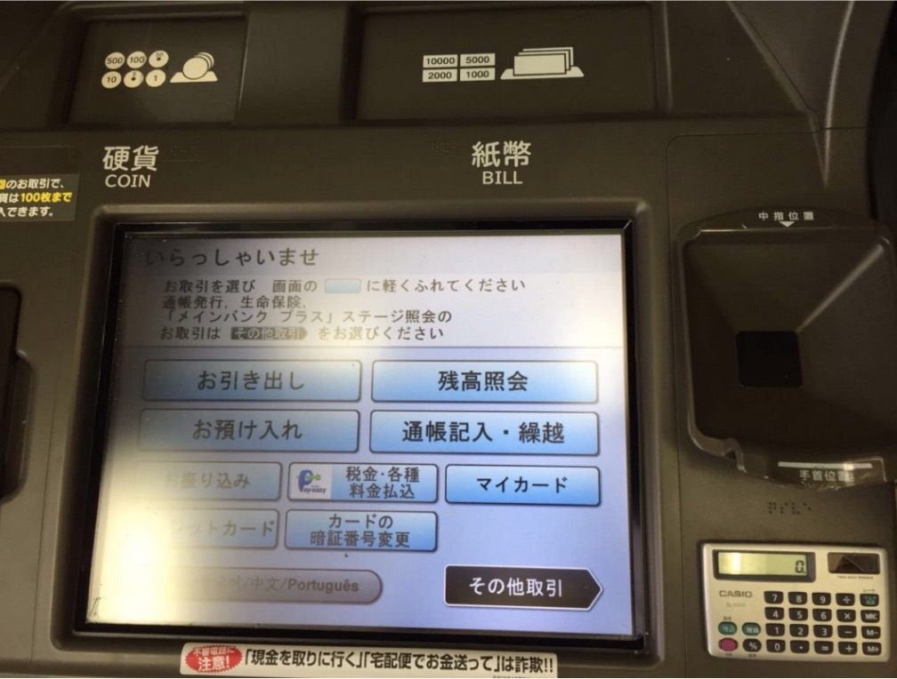
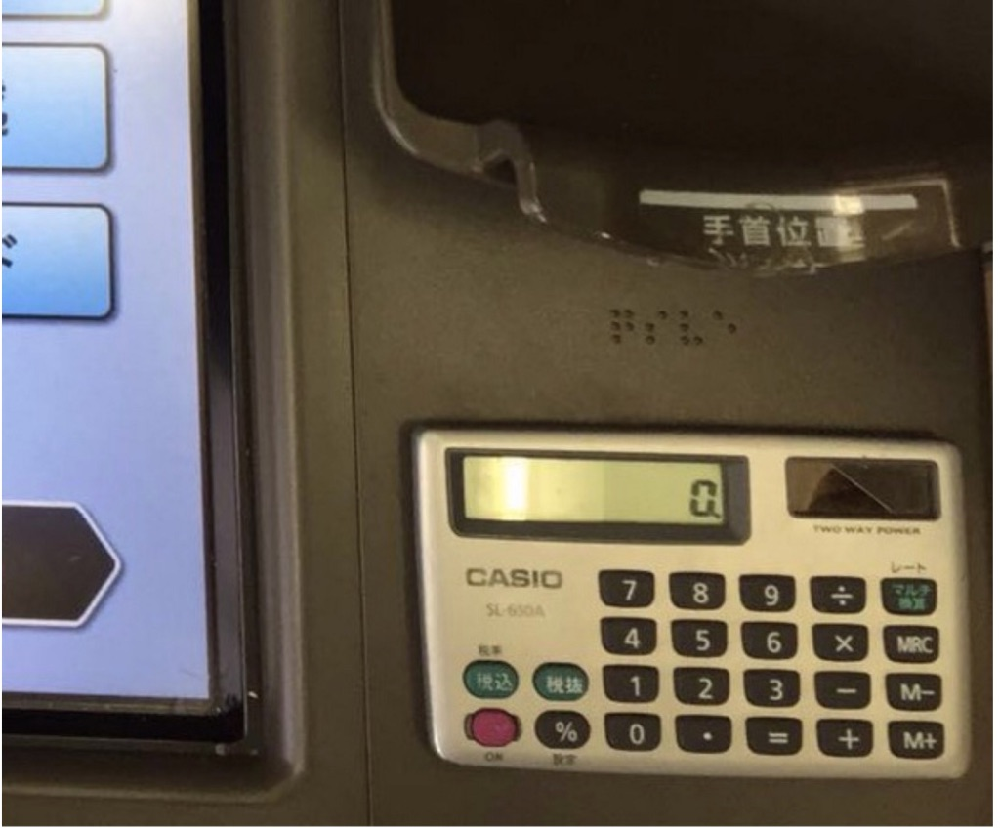
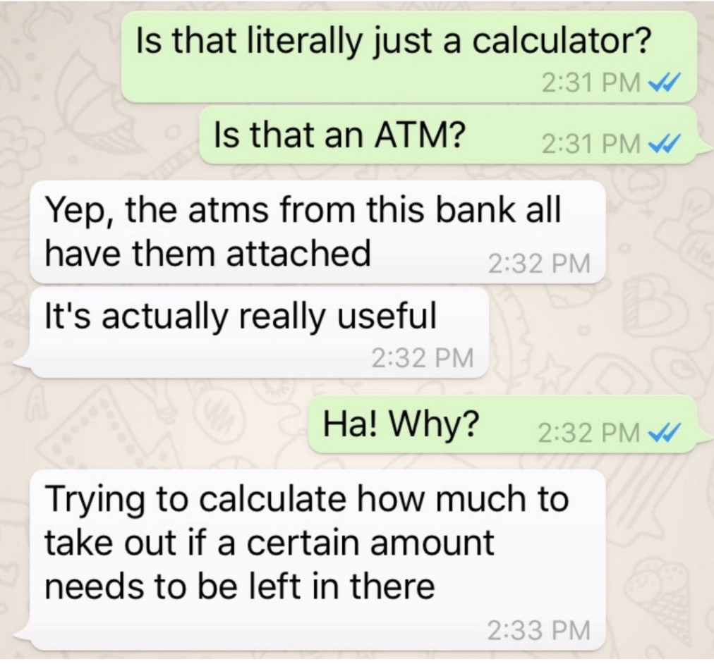

# 日本ATM的设计研究

我居住在东京的伙伴克林顿刚送我这个：

他知道我在银行工作，喜欢寻找奇怪的银行技术。我不确定他在做什么，也没有解释日文屏幕。然后他补充说：

WTF！ATM上有一个卡西欧计算器。看起来就像一个小孩会上学。

现在，我承认，我的第一个想法是“那些疯狂的日本人！”。当我在日本的最后一次时，货币技术在1990年安装时看起来都很具有未来感，并且从未真正更新过。这就像是对未来的复古愿景。

但是，优秀的设计研究人员应该始终认为设计选择背后有原因。即使它已经过时或从未真正解决问题，但有人试图解决这个问题。设计研究就是要真正揭示和理解人们普遍存在的问题。这是我与克林顿的一点交流：

它就是。

克林顿的问题是想知道他可以提取多少，并留下足够的收入。他用小卡西欧和他的记忆来完成它。

这种小小的洞察力可以为解决问题提供一种全新的方式。例如，如果银行知道克林顿可能即将到来的账单和存款，它可以做一个快速计算并给出建议的最大提款，或者如果他试图拿走更多的话就警告他。这可能是一件小事，但可以避免很多麻烦。

现在显然这只是一个例子。但有一个更大的问题; 当你进行设计研究并看到奇怪的东西时，请确保你发现了意图。你可能只是找到一个值得解决的问题的宝石。
