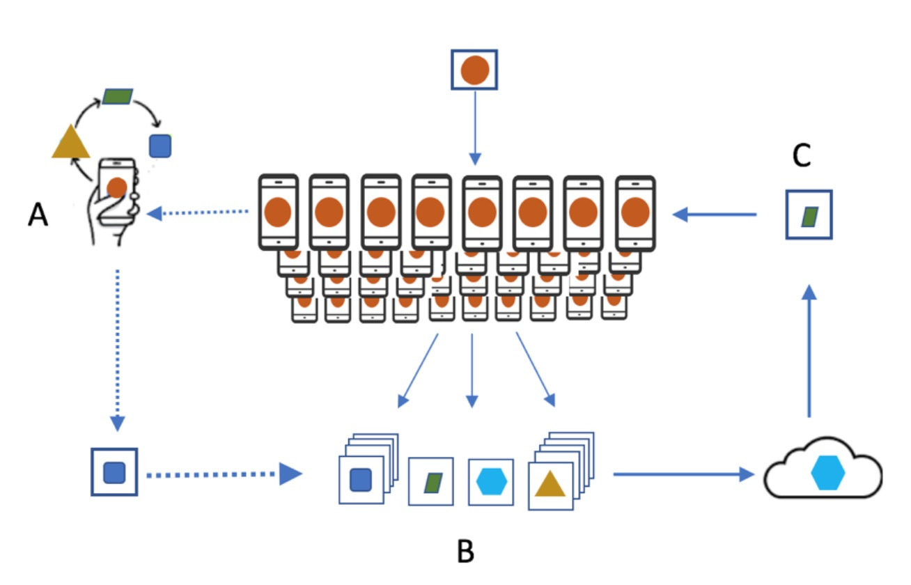
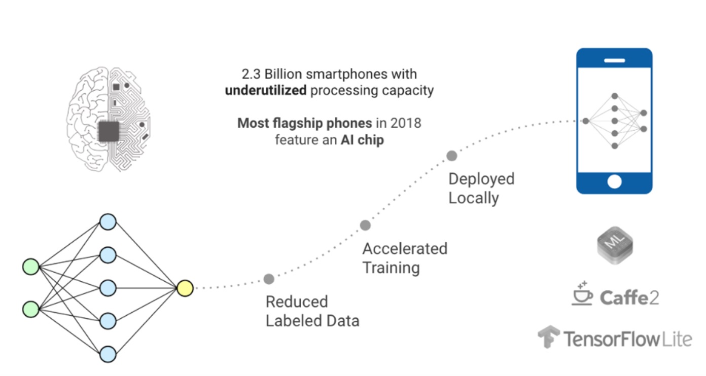

# 人工智能的新曙光：联邦学习

联邦学习，是一个新的人工智能（AI）模型开发框架，分布在数百万个移动设备上，提供高度个性化的模型，不会损害用户隐私。模型开发，培训和评估，无法直接访问或标记原始用户数据。在像印度这样的市场中，超个性化和情境推荐将成为推动应用程序采用或购买电子商务的关键，可以肯定的是联邦学习将在2019年发挥关键作用。人工智能世界的新曙光和新希望！

新兴的人工智能市场模式由谷歌，亚马逊和微软等科技巨头主导，他们提供基于云的人工智能解决方案和API。这种模式使用户几乎无法控制AI产品的使用以及从他们的设备，位置等收集的自己的数据。从长远来看，这种集中模式对社会或市场不利，因为它可能导致垄断只有少数强势球员。最终，它将限制小型公司甚至大型企业参与AI创新，以及缺乏AI系统驱动的决策的互操作性和可解释性。幸运的是，随着AI的春天在2019年出现，我们看到了分散的AI市场的开始，它出现在设备AI，区块链和边缘计算/物联网的交叉点上。

标准机器学习模型需要在一台机器或数据中心集中培训数据。例如，当电子商务初创公司想要开发一个模型来了解其消费者购买产品的倾向时，它会根据从其网站或应用程序收集的数据运行模型。这些数据可能包括在特定产品页面上花费的时间，一起购买的产品，浏览但购买的产品等。通常，在一段时间内，每个用户收集50到甚至高达1000的数据点。这些数据被传递并发送到集中式数据中心或计算机。

最近，一种新的方法被考虑用于通过用户与移动设备的交互训练的模型：它被称为联合学习。联合学习将机器学习过程分配到边缘。它使移动电话能够使用设备上的训练数据协作学习共享模型，并将数据保存在设备上。它将机器学习的需求与将数据存储在云中的需求分离开来。

### 什么是联邦学习？

虽然比较可能有些简单，但计算历史可能是联邦学习的全部代表。在信息技术的早期，我们有大型大型机在繁重的大部分计算中。最后，我们转移到客户端服务器框架，其中计算分布在中央服务器和多个客户端计算机之间。

联邦学习体系结构部署了类似的模型。机器学习模型不是在大型集中式机器上计算，而是分布在移动设备上进行计算。这种计算模型虽然在理论上是可行的，但在过去并不实用，因为移动电话的计算能力对于运行任何ML模型都非常有限。

然而，在2018年中后期发生了一些变化。作为一款配备AI芯片和重要计算能力的十亿多智能手机，从三星S9或Apple X系列开始，在未来3 - 5年内上市，许多ML型号将能够在这些移动设备上本地运行。

在功能上，作为FL计算架构的一部分的移动设备下载用于在移动设备上运行的模型。然后，它在手机上本地运行模型，并通过学习存储在那里的数据来改进它。随后，它将更改汇总为小更新，通常包含模型参数和相应的权重。

然后使用加密通信（例如，同态加密（HE））将对模型的更新发送到云或中央服务器。然后，此更新将与其他用户更新进行平均，以改进共享模型。最重要的是，所有培训数据都保留在用户的设备上，并且没有单独的更新可识别地存储在云中。

联邦学习允许更快地部署和测试更智能的模型，更低的延迟和更低的功耗，同时确保隐私。此外，除了为共享模型提供更新外，还可以立即使用手机上的改进（本地）模型，通过您使用手机的方式为个性化体验提供动力。

### 什么能促进联邦学习的成长？

在接下来的几年中，基于联合学习并使用同态加密保护的模型构建和边缘计算将取得重大进展。在未来3 - 5年内，随着10亿多智能手机配备了AI芯片并拥有强大的计算能力，许多ML型号将能够在这些移动设备上本地运行。与中央计算设施相比，通过“边缘”智能手机分发重型分析和计算将大大缩短开发数据产品的时间，例如超个性化推荐引擎，电子商务定价引擎等。企业将拥抱分布式机器学习模型构建框架，用于利用更快的模型部署并更快地响应快速变化的消费者行为，

对于机器学习从业者和爱好者来说，这种模式转变为AI民主化提供了一个令人兴奋的机会。它还开辟了采用新工具的新途径，最重要的是，它是解决大规模ML问题的新思路。

模型开发，培训和评估一开始就没有直接访问或标记原始数据的挑战。然而，在印度这样的新兴市场中，超个性化和高度上下文推荐引擎将成为推动发言权，应用程序采用或电子商务购买的关键，我们的赌注是联邦学习将在未来发挥关键作用。我们相信联邦学习的用户利益可以解决技术带来的挑战。
