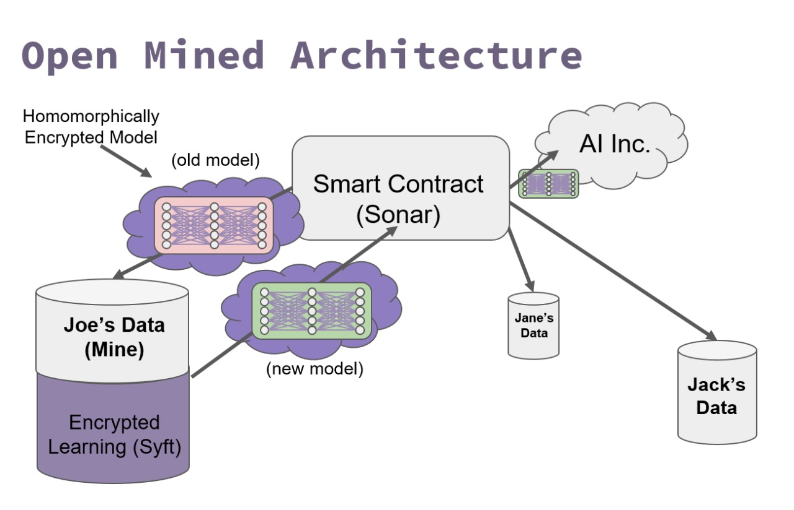

# 联邦学习简介

### 什么是联邦学习

联邦学习可以在不直接访问训练数据的情况下构建机器学习系统。数据保留在原始位置，这有助于确保隐私并降低通信成本。

### 为什么需要联邦学习

* 隐私问题（我不想分享我的自己的照片），联邦学习可以不将你的数据共享出去。

* 监管需要（HIPAA，GDPR等），保护用户私有数据，使用联邦学习可以将模型下发到用户侧进行训练。

* 解决数据孤岛问题，如：互联网企业、银行间数据不可能共享，模型使用联邦学习可以在各家企业、银行的私有数据上进行训练。

* 工程障碍，数据量太大，网络连接昂贵，速度慢或不可靠等，采用联邦学习可以避免这些问题。

### 联邦学习能做什么

现在让我们看一下你可以用联邦学习做些什么的一些例子。

#### 1.智能手机
机器学习具有改善智能手机用户体验的巨大潜力。应用程序可以学习发现好的宝贝照片，并主动提供与朋友和家人分享。他们可以更容易地编写更有可能收到快速回复的电子邮件。通过准确地建议下一个短语，无论语言如何，他们都可以更快速，更轻松地撰写短信。

但是，除了将这些数据从连接速度较慢的设备中取出的实际挑战之外，某些数据的个人方面（人们输入的内容，他们旅行的地点，他们访问的网站）使其成为问题。用户不愿意共享这些敏感数据，拥有它会使技术公司面临安全风险和监管负担。这些特性使其非常适合联邦学习。用例非常引人注目，谷歌的研究人员通常会将其发明归功于此，三星工程师也提出了重要的想法。

#### 2.卫生保健
医疗行业为开发有效的治疗方法和预测结果提供了巨大的经济激励。但是，将机器学习应用于这些问题所需的培训数据当然非常敏感。实际和潜在隐私侵犯的后果可能很严重。

通过将培训数据保存在患者或提供者手中，联合学习有可能协作构建拯救生命并产生巨大价值的模型。总部位于巴黎的Owkin是我们在研究期间与之交谈的最雄心勃勃的联邦学习用户之一。它们提供了一个平台，使医疗保健提供商能够就各种医疗保健问题进行合作。

#### 3.预测性维护
假设制造商想要为他们销售的设备开发预测性维护模型。该模型需要培训数据 - 但是为了获得该数据而对于制造商来说，测试许多涡轮机直到它们失败为止。如果制造商的客户要发送这样的数据，那么制造商的成本会降低。更重要的是，实际客户体验的失败将比制造商在工厂实验中看到的更能代表现实世界的使用。简而言之，从客户那里获得的培训数据会更便宜，更好。

#### 4.分散数据的聚合分析
一个用户在多家银行借贷，但是多家银行数据不通，通过联邦学习的聚合分析可以分析出用户是否在多家银行借贷，从而避免风险。

#### 5. URL输入建议

Firefox实施的联邦学习系统，是改进Firefox URL栏中显示的部分建议。

Firefox URL栏显示用户键入搜索查询时的建议。这些建议的一部分由搜索引擎直接提供。其他由Firefox本身生成，例如基于用户的历史记录，书签或打开的选项卡。我们尝试使用我们的项目优化历史记录和书签建议。

更多信息，请访问[Federated Fearning For Firefox/](https://florian.github.io/federated-learning-firefox/)

### 如何进行联邦学习

下面给出一些公司的解决方案：

#### 1. OpenMend

从技术角度来看，OpenMined将联邦学习的原理与同态加密和区块链智能合约等尖端技术相结合，使协作模型能够以完全分散的方式实现深度学习应用。

OpenMined架构基于四个基本构建块：

#### Capsule

用于生成公钥和私钥的PGP服务器，以保证Sonar神经网络的不同组件的完整性。

#### Sonar

OpenMined平台的核心，Sonar是一个联邦学习服务器，运行在区块链上，用于控制深度学习应用程序不同部分的执行。该库与Capsule通信以生成PGP密钥，并将最终的，经过培训的结果发送回Data Scientist。它还与矿工沟通，收集Gradients并相应地分发Bounty。

#### Mine
该组件分布在用户的各个数据存储库中。Mine与Sonar相互作用以探测新的神经网络。上传到矿山的数据越多，它与Sonar的相关性就越高。

#### Syft

包含神经网络的库，可以在加密状态下进行训练（这样矿工就无法窃取他们下载的神经网络进行训练）。它构建在PyTorch之上

更多信息，请访问 [OpenMined Github](https://github.com/openmined/pysyft)

#### 2. TensorFlow_Federated(TFF)

TensorFlow Federated（TFF）是一个开源框架，用于机器学习和分散数据的其他计算。TFF的开发旨在促进联邦学习（FL）的开放式研究和实验，这是一种机器学习方法，在这种方法中，共享的全球模型在许多参与的客户中进行培训，这些客户将他们的培训数据保存在本地。例如，FL已被用于训练移动键盘的预测模型，而无需将敏感的键入数据上载到服务器。

TFF使开发人员能够在其模型和数据上模拟所包含的联邦学习算法，并尝试新颖的算法。TFF提供的构建块还可用于实现非学习计算，例如对分散数据的聚合分析。TFF的界面分为两层：

##### 1）[Federated Learning（FL）API](https://www.tensorflow.org/federated/federated_learning)
该层提供了一组高级接口，允许开发人员将所包含的联合培训和评估实现应用于现有的TensorFlow模型。

##### 2）[Federated Core（FC）API](https://www.tensorflow.org/federated/federated_core)
该系统的核心是一组低级接口，通过在强类型函数编程环境中将TensorFlow与分布式通信运算符相结合，简洁地表达新的联合算法。这一层也是我们建立联邦学习的基础。

更多信息，请访问 [Tensorflow Federated](https://www.tensorflow.org/federated)

#### 3. Cloudera Federated

Cloudera 提供一个交互式联合学习原型，[Turbofan Tycoon](https://turbofan.fastforwardlabs.com/)
，它是Cloudera Fast Forward Labs的研究原型，随着cloudera的联邦学习报告而建立。它使用逼真的涡轮风扇数据来显示使用联邦学习预测模型的好处。

更多信息，请阅读[An introduction to Federated Learning](http://vision.cloudera.com/an-introduction-to-federated-learning/)

#### 4. WeBank

Federated AI Technology Enabler（FATE）是由Webank的AI小组发起的一个开源项目，旨在提供一个安全的计算框架来支持Federated AI生态系统。

更多信息，请访问[WeBank](https://www.fedai.org/)

### 结论

联邦学习的明显好处是在大量设备上分配知识质量，而无需集中用于优化和训练模型的数据。该方法还能够在保持训练数据集的隐私的同时提高集中式机器学习模型的质量。但是，联邦学习并非没有问题。与任何其他软件架构一样，分散化在工作协调，管理或监控等领域引入了挑战。如果不出意外，联邦学习将是传统的集中式监督和半监督学习架构的一个补充，而不一定是替代。
